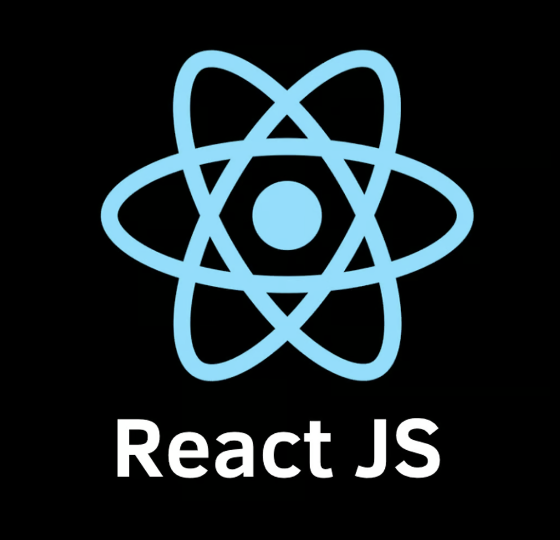
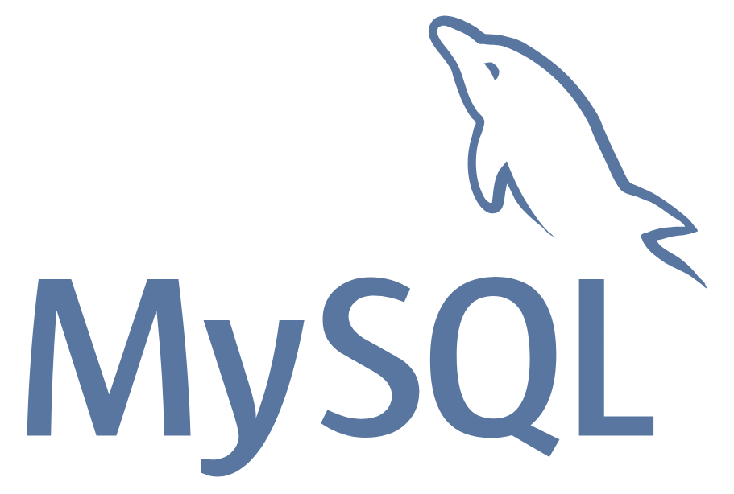

**Sheldon** is an experienced Full Stack developer looking for 💰 opportunities.

- 📫 sheldon@pasciak.com
- 👔 [LinkedIn](https://www.linkedin.com/in/sheldonpasciak)
- 🔗 [GitHub](https://github.com/pasciaks)
- 🏡 [https://pasciak.com](https://pasciak.com)

✨ My Software Development LifeCycle / Plans ... ✨

- 🌱 I’ve recently completed
  - Full Stack JAVA Bootcamp with Skill Distillery
  - Meta Front End Developer Course
- 🌱 I’m continually learning ... JAVA, Angular, React and NodeJS

✨ Ask me about 🤔 ... 💬 The words! ✨

- ⚡ Stop playing with yourself - A philosophy of life in a word game - http://lostwords.org

## Tools 🛠️ and Languages 💬

HTML/CSS/Bootstrap API - Weather Forecasts and Map

- https://github.com/pasciaks/codeup-web-exercises/blob/de9aa01303e619be9cbbaa365ce9144ef60822fe/WEATHER_MAP.md#user-interface-frontend

Java JPA CRUD, HTML/CSS/Bootstrap JavaScript - Lostwords Org Library

- https://github.com/pasciaks/JPACRUDProject/tree/c4873387759dad96695e64f63927d7b40a1110d0?tab=readme-ov-file#jpacrudproject

Java Full Stack - MySQL, JPA, Spring Boot, HTML, CSS, Bootstrap, Angular - Event Tracker - US Cities

- https://github.com/pasciaks/EventTrackerProject?tab=readme-ov-file#eventtrackerproject---sheldon-pasciak-skill-distillery

Java Full Stack - MySQL, JPA, Spring Boot, Angular - Lesson Locker

- https://github.com/pasciaks/LessonLocker/tree/main?tab=readme-ov-file#finalproject

 

#### Skilled with: &nbsp;

<table>
    <tr>
      <td> JAVA</td>
      <td> Spring</td>
      <td> Spring Boot</td>
    </tr>
    <tr>
      <td>NodeJS</td>
      <td>React JS</td>
      <td>Angular</td>
      </tr>
    <tr>
      <td> MySQL</td> 
      <td> PostgreSQL</td> 
      <td> Mongoose</td> 
    </tr>
    <tr>
      <td>HTML5</td>
      <td>CSS3</td>
      <td>JavaScript</td>
      <td>TypeScript</td>
    </tr>
</table>

<table>
    <tr>
      - Frontend, Backend, UI/UX, Scripting/Database 
      - HTML, CSS, Typescript, JavaScript, JQuery 
      - React, Angular, EJS, Bootstrap 
      - NodeJS-Express, NextJS, C# 
      - Linux, MAC, Windows, SQL, NOSQL, JSON 
    </tr>
</table>
